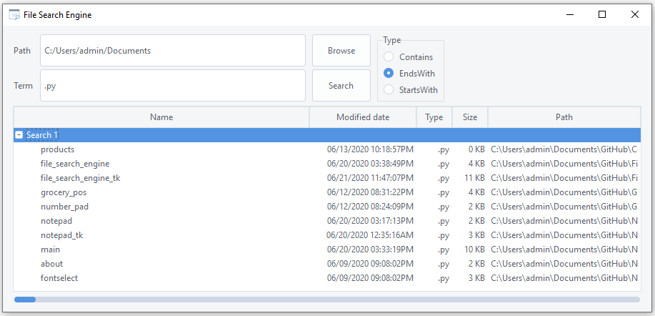
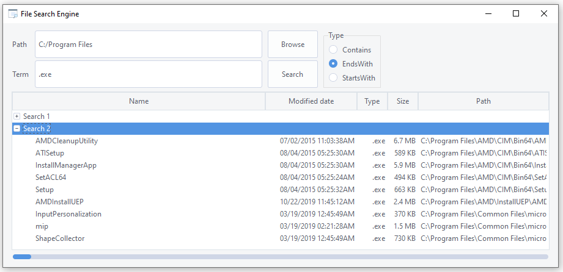
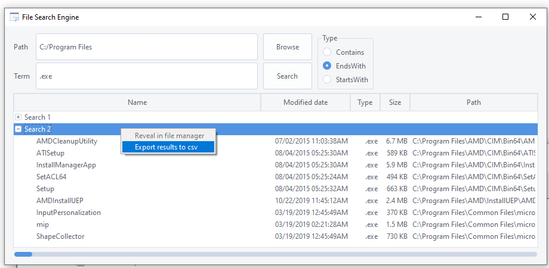
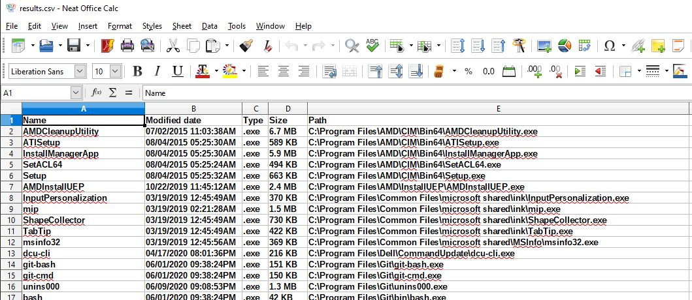
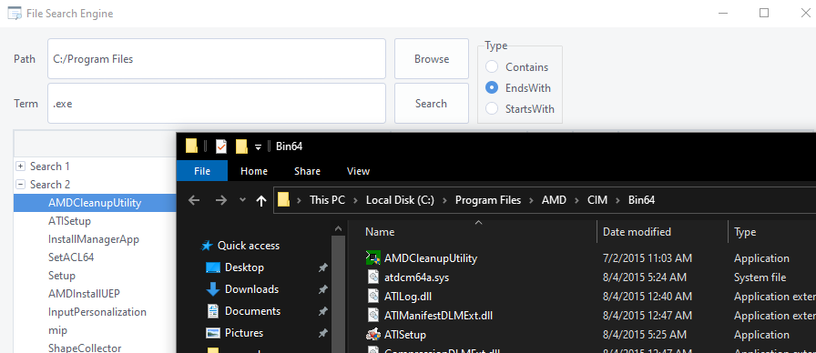

# File-Search-Engine-Tk
 A file search engine built with Tkinter.  
 
 - Perform a variety of filename searches (contains, startswith, endswith).
 - Each search is collected in a treeview marked with the search number.
 - Right-click on a search collection to export to a CSV file
 - Right-click _or_ Double-Click on a result item to reveal the result in the file manager.
  
  
  
Right-click on a collecton to export to a csv file  
  
  
Double-clicking on the result will open the file manager to that location  

